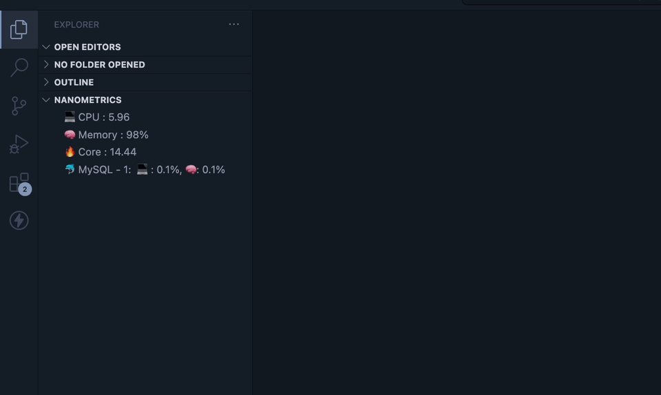

# Nano Metrics - VSCode Extension

Explore and monitor system metrics effortlessly with this quick and convenient VSCode extension. Access real-time information on CPU load, memory usage, core load, and running instances of various services right from the side panel. Stay informed about your system's health and performance with ease.

## Features

- Real-time CPU Load
- Live Memory Usage
- Core Load Monitoring
- Running Instances of Services
  - MySQL
  - Apache
  - Elasticsearch
  - Docker
  - MongoDB
  - Nginx
  - Kafka
  - PostGres
  - RabbitMQ
  - Redis
  - SQL Server
- (Coming Soon)...and more!

## Installation

1. Open Visual Studio Code
2. Go to Extensions (or press `Ctrl+Shift+X`)
3. Search for "Nano Metrics"
4. Install the extension

## Usage

1. Open the Nano Metrics side panel
2. Explore real-time system metrics and service information
3. Stay informed about your system's health

## Contribution

Feel free to contribute to this project by reporting issues or submitting pull requests. Visit our [GitHub repository](https://github.com/nuhmanpk/nanometrics) to get involved. Your feedback and contributions mean a lot as we continue to enhance and improve Nano Metrics. This project is under active development, and your input is invaluable.

## License

This project is licensed under the MIT License - see the [LICENSE](https://github.com/nuhmanpk/nanometrics) file for details.

🚀 Happy coding !!!

